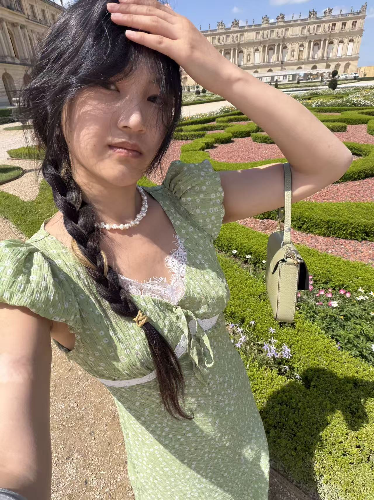

<div align="center">



# ✿ iLacey — My Little Digital Space ✿

### `把喜欢的东西，做成可以看见的作品。`

<p>
  
  
  
</p>

**[♡ 打开我的数字手账 ♡](https://laceyxinx.github.io/ilacey/)**

`(｡•̀ᴗ-)✧ Welcome to Lacey's creative archive!`

</div>

---

## ୨୧ 关于这个网站

这是 **Lacey / 骆锦昕** 的个人作品集，也是一本可以点击的数字线圈手账。

这里收录了我的设计、代码、生活存档和一些还在慢慢长大的想法。网站以粉色 Y2K、复古电脑窗口和手账元素为视觉灵感，希望每一个页面不只有功能，也能留下一点情绪和温度。

> 这里不是冷冰冰的项目列表，而是我的一小块互联网自留地。 ♡

## ˚₊‧ 页面里有什么

| 文件夹 | 内容 |
|:---:|---|
| 🏠 **HOME** | 欢迎页、近期内容与生活存档 |
| 📁 **WORKS** | 项目作品和 GitHub 入口 |
| 🌸 **ABOUT** | 关于我、兴趣与个人关键词 |
| 💌 **CONTACT** | 联系邮箱laceyjinxin@gmail.com |

## ✦ 设计亮点

- 📒 线圈手账式单屏界面
- 📂 中英双语文件夹导航
- 💿 可播放并拖动进度的音乐卡片
- 🌷 Pastel Y2K 粉紫视觉系统
- 🖱️ 页面切换与鼠标悬停动效
- 📱 桌面端与移动端响应式适配
- 🧸 真实照片、生活记录与个人化细节

## ⌨ Tech Stack

```text
HTML5       页面结构
CSS3        视觉、布局与响应式设计
JavaScript  页面切换、音乐与交互动效
GitHub Pages  网站托管
```

这个项目没有使用大型框架或构建工具，打开 `index.html` 即可运行。

## ♡ 本地预览

```bash
git clone https://github.com/Laceyxinx/ilacey.git
cd ilacey
```

然后直接用浏览器打开 `index.html`，或使用任意静态文件服务器运行。

## ☁ 项目结构

```text
ilacey/
├── assets/       # 照片、音乐与封面素材
├── index.html    # 页面内容
├── styles.css    # 界面样式与响应式布局
├── script.js     # 页面和音乐交互
└── README.md     # 你正在看的文件 ♡
```

## ✉ 找到我

如果你有有趣的想法，或者只是想打个招呼：

**Email:** [laceyjinxin@163.com](mailto:laceyjinxin@gmail.com)<br>
**GitHub:** [@Laceyxinx](https://github.com/Laceyxinx)

---

<div align="center">

### Thanks for stopping by! ꒰ঌ(っ˘꒳˘ｃ)໒꒱

`made with love, pixels & probably too much pink ♡`

<sub>© 2026 Lacey / 骆锦昕</sub>

</div>
